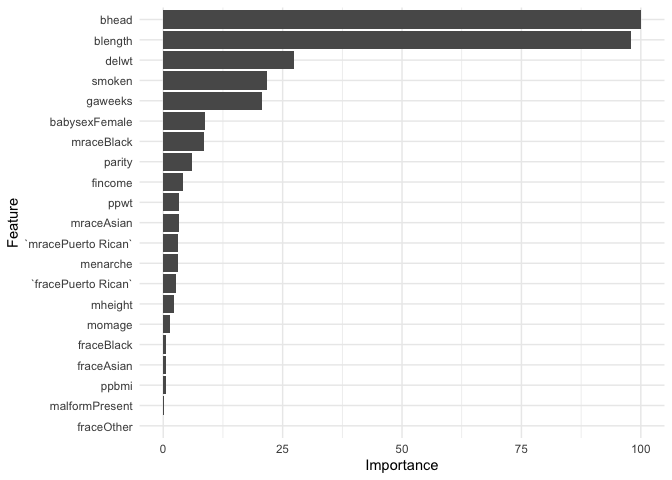
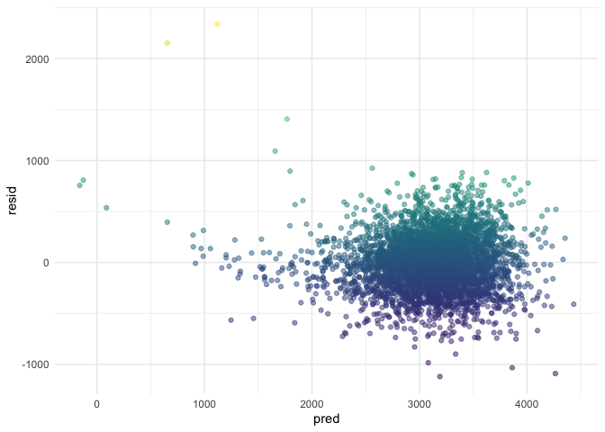
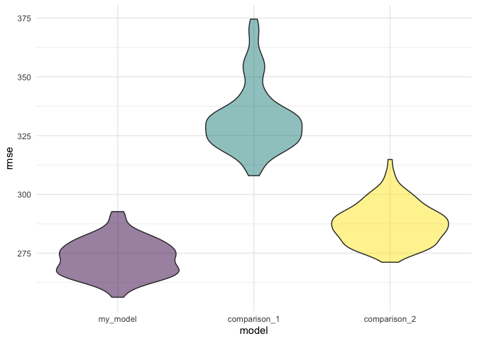
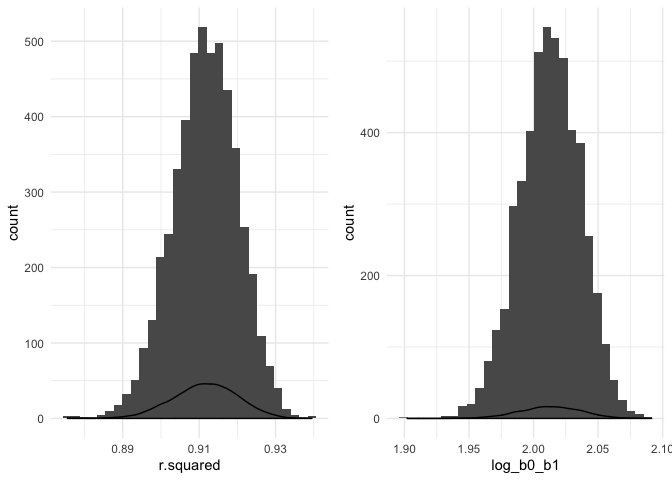

p8105\_hw6\_mk4208
================
Meeraj Kothari
11/19/2019

# Loading libraries

``` r
library(tidyverse)
library(modelr)
library(mlbench)
library(caret)
library(patchwork)
library(viridis)
```

# Problem 1

Following code chunk loads and cleaning the data for regression analysis
and checks for missing data producing a
summary.

``` r
birthweight = read_csv("./Data/birthweight.csv") %>% janitor::clean_names() %>% 
  mutate(babysex = factor(babysex, c(1, 2), c("Male", "Female")),
         frace = factor(frace, c(1:4, 8, 9), c("White", "Black", "Asian", "Puerto Rican", "Other", "Unkown")),
         malform = factor(malform, c(0, 1), c("Absent", "Present")),
         mrace = factor(mrace, c(1:4, 8), c("White", "Black", "Asian", "Puerto Rican", "Other")))

skimr::skim(birthweight)
```

    ## Skim summary statistics
    ##  n obs: 4342 
    ##  n variables: 20 
    ## 
    ## ── Variable type:factor ──────────────────────────────────────────────────────────────────────────────
    ##  variable missing complete    n n_unique
    ##   babysex       0     4342 4342        2
    ##     frace       0     4342 4342        5
    ##   malform       0     4342 4342        2
    ##     mrace       0     4342 4342        4
    ##                               top_counts ordered
    ##              Mal: 2230, Fem: 2112, NA: 0   FALSE
    ##  Whi: 2123, Bla: 1911, Pue: 248, Asi: 46   FALSE
    ##                Abs: 4327, Pre: 15, NA: 0   FALSE
    ##  Whi: 2147, Bla: 1909, Pue: 243, Asi: 43   FALSE
    ## 
    ## ── Variable type:numeric ─────────────────────────────────────────────────────────────────────────────
    ##  variable missing complete    n      mean     sd     p0     p25     p50
    ##     bhead       0     4342 4342   33.65     1.62  21      33      34   
    ##   blength       0     4342 4342   49.75     2.72  20      48      50   
    ##       bwt       0     4342 4342 3114.4    512.15 595    2807    3132.5 
    ##     delwt       0     4342 4342  145.57    22.21  86     131     143   
    ##   fincome       0     4342 4342   44.11    25.98   0      25      35   
    ##   gaweeks       0     4342 4342   39.43     3.15  17.7    38.3    39.9 
    ##  menarche       0     4342 4342   12.51     1.48   0      12      12   
    ##   mheight       0     4342 4342   63.49     2.66  48      62      63   
    ##    momage       0     4342 4342   20.3      3.88  12      18      20   
    ##    parity       0     4342 4342    0.0023   0.1    0       0       0   
    ##   pnumlbw       0     4342 4342    0        0      0       0       0   
    ##   pnumsga       0     4342 4342    0        0      0       0       0   
    ##     ppbmi       0     4342 4342   21.57     3.18  13.07   19.53   21.03
    ##      ppwt       0     4342 4342  123.49    20.16  70     110     120   
    ##    smoken       0     4342 4342    4.15     7.41   0       0       0   
    ##    wtgain       0     4342 4342   22.08    10.94 -46      15      22   
    ##      p75   p100     hist
    ##    35      41   ▁▁▁▁▅▇▁▁
    ##    51      63   ▁▁▁▁▁▇▁▁
    ##  3459    4791   ▁▁▁▃▇▇▂▁
    ##   157     334   ▁▇▅▁▁▁▁▁
    ##    65      96   ▁▂▇▂▂▂▁▃
    ##    41.1    51.3 ▁▁▁▁▃▇▁▁
    ##    13      19   ▁▁▁▁▂▇▁▁
    ##    65      77   ▁▁▁▅▇▂▁▁
    ##    22      44   ▂▇▅▂▁▁▁▁
    ##     0       6   ▇▁▁▁▁▁▁▁
    ##     0       0   ▁▁▁▇▁▁▁▁
    ##     0       0   ▁▁▁▇▁▁▁▁
    ##    22.91   46.1 ▁▇▅▁▁▁▁▁
    ##   134     287   ▁▇▆▁▁▁▁▁
    ##     5      60   ▇▁▁▁▁▁▁▁
    ##    28      89   ▁▁▁▇▇▁▁▁

The following code chunks use the `caret` package and the `mlbench`
package to rank feature importance.

  - First, I do 10 repeats of 10-fold CV for the data and train a
    generalized linear model for the `bwt` variable. The `varImp`
    function ranks the importance based on the absolute value of the
    t-statistic for each model parameter used.

<!-- end list -->

``` r
set.seed(10)

control = trainControl(method = "cv", number = 10, repeats = 10)

model = train(bwt~., data = birthweight, method = "glm", preProcess = "scale", trControl = control)

importance = varImp(model, scale = TRUE)
```

  - Second, I plot the imporance of each parameter.

<!-- end list -->

``` r
ggplot(importance) + 
  theme_minimal()
```

<!-- -->

Based on the above produced plot, I select `bhead`, `blength`, `delwt`,
`smoken`, `babysex`, `gaweeks` and `mrace` as my predictors and fit a
linear
model.

``` r
my_model = lm(bwt ~ bhead + blength + delwt + smoken + gaweeks + babysex + mrace, data = birthweight)
```

The following code chunk produces a plot of model residuals against
fitted values using `add_predictions` and `add_residuals`.

``` r
birthweight %>% 
  modelr::add_residuals(my_model) %>% 
  modelr::add_predictions(my_model) %>% 
  ggplot(aes(x = pred, y = resid, color = resid)) +
  geom_point(alpha = 0.5) + 
  scale_color_viridis() +
  theme_minimal() +
  theme(legend.position = "none")
```

<!-- -->

Following code chunks produces two comparision models:

  - `comparison_1` uses length at birth and gestational age as
    predictors (main effects only)

  - `comparison_2` uses head circumference, length, sex, and all
    interactions (including the three-way interaction) between these.

<!-- end list -->

``` r
comparison_1 = lm(bwt ~ blength + gaweeks, data = birthweight)

comparison_2 = lm(bwt ~ bhead + blength + babysex + bhead*blength + blength*babysex + babysex*bhead + bhead*blength*babysex, data = birthweight) 
```

Following code chunk compares the 3 models in terms of the
cross-validated prediction error, using `crossv_mc`.

``` r
cv_df = 
  crossv_mc(birthweight, 100) %>% 
  mutate(
    train = map(train, as_tibble), 
    test = map(test, as_tibble))

cv_df = cv_df %>%
  mutate(my_model = map(train, ~lm(bwt ~ bhead + blength + delwt + smoken + gaweeks + babysex + mrace, data = .x)),
         comparison_1 = map(train, ~lm(bwt ~ blength + gaweeks, data = .x)),
         comparison_2 = map(train, ~lm(bwt ~ bhead + blength + babysex + bhead*blength + blength*babysex + babysex*bhead + bhead*blength*babysex, data = .x))) %>% 
  mutate(rmse_my_model = map2_dbl(my_model, test, ~rmse(model = .x, data = .y)),
         rmse_comparison_1 = map2_dbl(comparison_1, test, ~rmse(model = .x, data = .y)),
         rmse_comparison_2 = map2_dbl(comparison_2, test, ~rmse(model = .x, data = .y)))

cv_df %>% 
  select(starts_with("rmse")) %>%
  pivot_longer(
    everything(), 
    names_to = "model",
    values_to = "rmse", 
    names_prefix = "rmse_") %>%
  mutate(model = fct_inorder(model)) %>%
  ggplot(aes(x = model, y = rmse, fill = model)) + 
  geom_violin() + 
  scale_fill_viridis_d(alpha = 0.5) + 
  theme_minimal() + 
  theme(legend.position = "none")
```

<!-- -->

# Problem 2

For this problem, we’ll use the 2017 Central Park weather data that
we’ve seen elsewhere. The code chunk below (adapted from the course
website) will download these data.

``` r
weather_df = 
  rnoaa::meteo_pull_monitors(
    c("USW00094728"),
    var = c("PRCP", "TMIN", "TMAX"), 
    date_min = "2017-01-01",
    date_max = "2017-12-31") %>%
  mutate(
    name = recode(id, USW00094728 = "CentralPark_NY"),
    tmin = tmin / 10,
    tmax = tmax / 10) %>%
  select(name, id, everything())
```

The following code chunk uses 5000 bootstrap samples and, for each
bootstrap sample, produce estimates of r² and log(β0\*β1).

``` r
results = weather_df %>% 
  modelr::bootstrap(n = 5000) %>% 
  mutate(
    models = map(strap, ~ lm(tmax ~ tmin, data = .x)),
    results = map(models, broom::tidy),
    glance = map(models, broom::glance)) %>% 
  select(results, glance, .id) %>% 
  unnest(results) %>% 
  pivot_wider( 
    names_from = term,
    values_from = c(estimate, std.error, glance),
    id_cols = .id, 
    ) %>%
  janitor::clean_names() %>%
  unnest(c(glance_intercept), .names_repair = "universal") %>% 
  mutate(
    log_b0_b1 = log(estimate_intercept * estimate_tmin)
  ) 
```

    ## Warning: unnest() has a new interface. See ?unnest for details.
    ## Try `df %>% unnest(c(`c(glance_intercept)`, .names_repair))`, with `mutate()` if needed

The following code chunk plots the distribution of r² and log(β0 \* β1)

``` r
p1 = results %>% 
  ggplot(aes(x = r.squared)) + 
  geom_histogram() + 
  geom_density() +
  theme_minimal() 

p2 = results %>% 
  ggplot(aes(x = log_b0_b1)) + 
  geom_histogram() + 
  geom_density() +
  theme_minimal() 

p1 + p2
```

<!-- -->

Both the distributions appear normally distributed. The mean of r² is
0.9115277 and the median of r² is 0.9117841. The mean of log(β0 \* β1)
is 2.0126729 and the median of log(β0 \* β1) is 2.0130705.

-----

The following tables give the 2.5% and 97.5% quantiles for the r² and
log(β0 \* β1) for the 95% confidence interval.

``` r
results %>% 
  pull(r.squared) %>% 
  quantile(c(0.025, 0.975)) %>% 
  knitr::kable(col.names = "R-Squared")
```

|       | R-Squared |
| ----- | --------: |
| 2.5%  | 0.8943607 |
| 97.5% | 0.9274472 |

``` r
results %>% 
  pull(log_b0_b1) %>% 
  quantile(c(0.025, 0.975)) %>% 
  knitr::kable(col.names = "Log(B0*B1)")
```

|       | Log(B0\*B1) |
| ----- | ----------: |
| 2.5%  |    1.965044 |
| 97.5% |    2.057463 |
