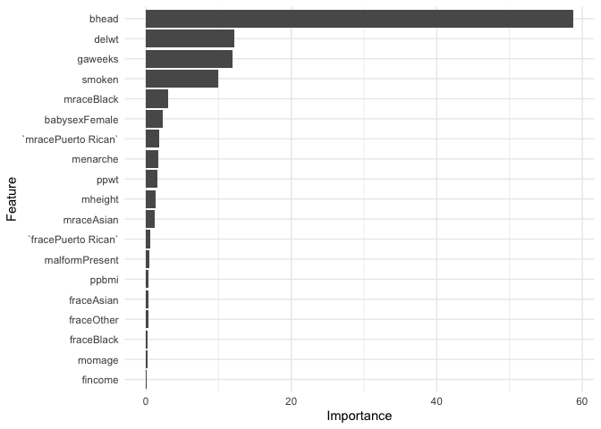

p8105\_hw6\_mk4208
================
Meeraj Kothari
11/19/2019

# Loading libraries

``` r
library(tidyverse)
library(modelr)
library(mlbench)
library(caret)
```

# Problem 1

``` r
birthweight = read_csv("./Data/birthweight.csv") %>% janitor::clean_names() %>% 
  mutate(babysex = factor(babysex, c(1, 2), c("Male", "Female")),
         frace = factor(frace, c(1:4, 8, 9), c("White", "Black", "Asian", "Puerto Rican", "Other", "Unkown")),
         malform = factor(malform, c(0, 1), c("Absent", "Present")),
         mrace = factor(mrace, c(1:4, 8), c("White", "Black", "Asian", "Puerto Rican", "Other")))
```

    ## Parsed with column specification:
    ## cols(
    ##   .default = col_double()
    ## )

    ## See spec(...) for full column specifications.

``` r
set.seed(10)

nums = map(birthweight, is.numeric) %>% unlist()

correlationMatrix = birthweight %>% select_if(is.numeric) %>% cor()

highlyCorrelated = correlationMatrix %>% findCorrelation(cutoff = 0.7)

birthweight_no_corr = birthweight %>% select(-highlyCorrelated, "bwt")

control = trainControl(method = "repeatedcv", number = 10, repeats = 3)

model = train(bwt~., data = birthweight_no_corr, method = "glm", preProcess = "scale", trControl = control)

importance = varImp(model, scale = FALSE)

ggplot(importance) + 
  theme_minimal()
```

<!-- -->

``` r
fit = lm(bwt ~ bhead + delwt + gaweeks + smoken + mrace + babysex, data = birthweight)
```

``` r
birthweight %>% 
  modelr::add_residuals(fit) %>% 
  modelr::add_predictions(fit) %>% 
  ggplot(aes(x = pred, y = resid)) +
  geom_point() + 
  theme_minimal()
```

<!-- -->

``` r
comparison_1 = lm(bwt ~ momage + gaweeks, data = birthweight)
```
